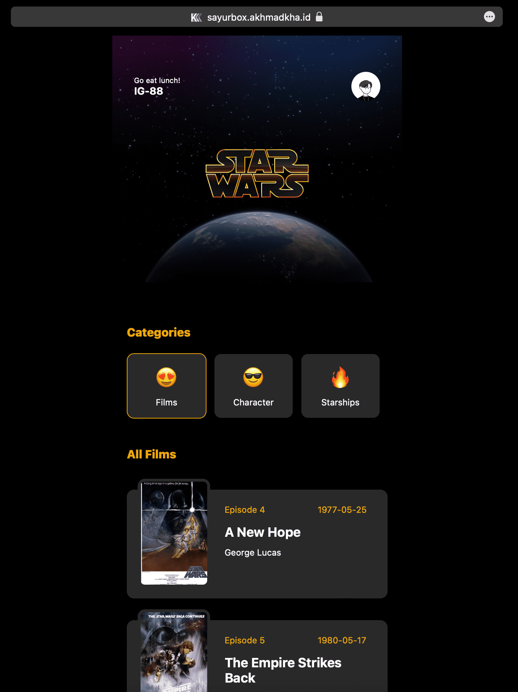
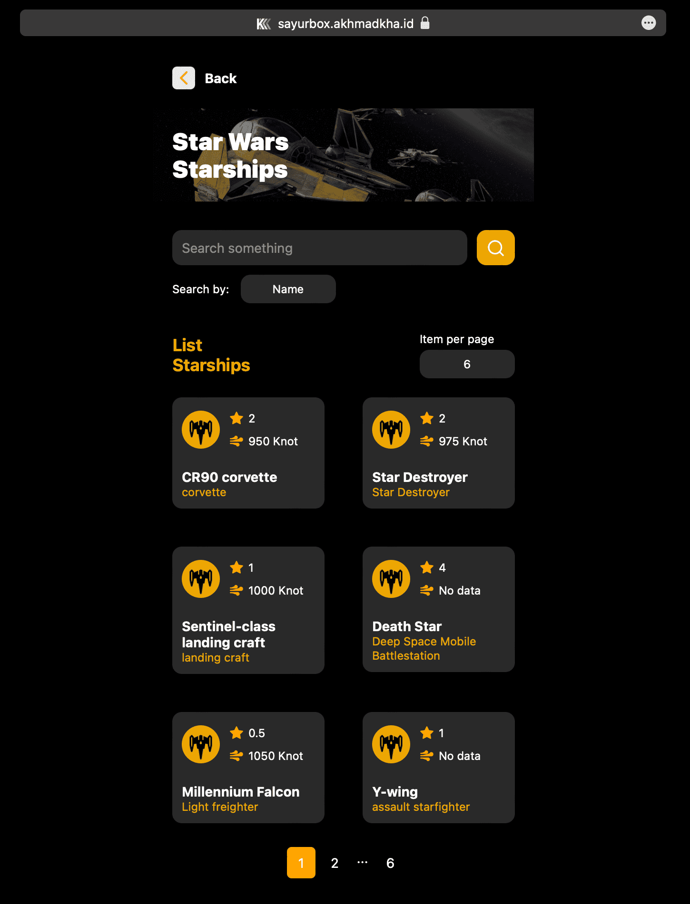
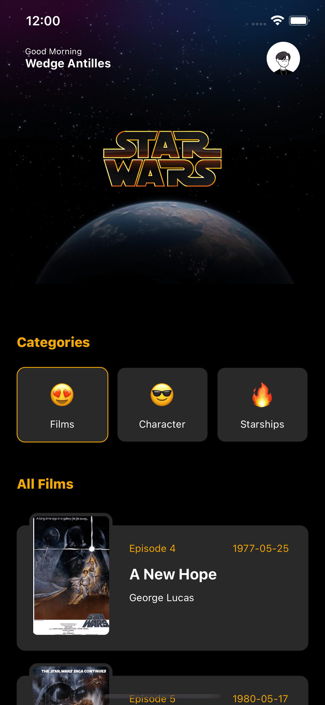
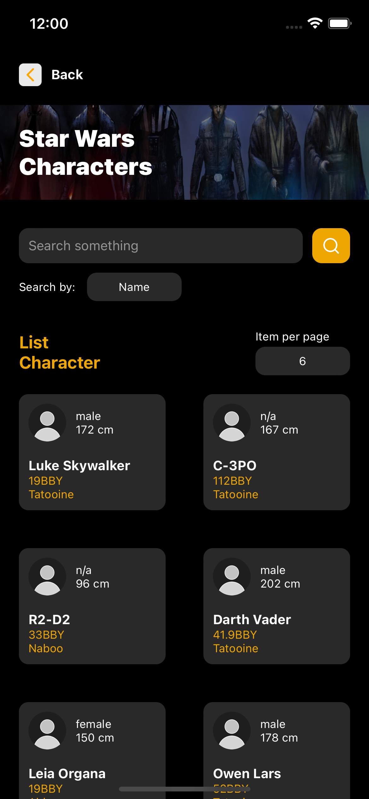
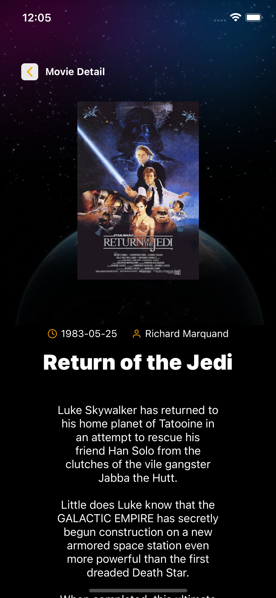
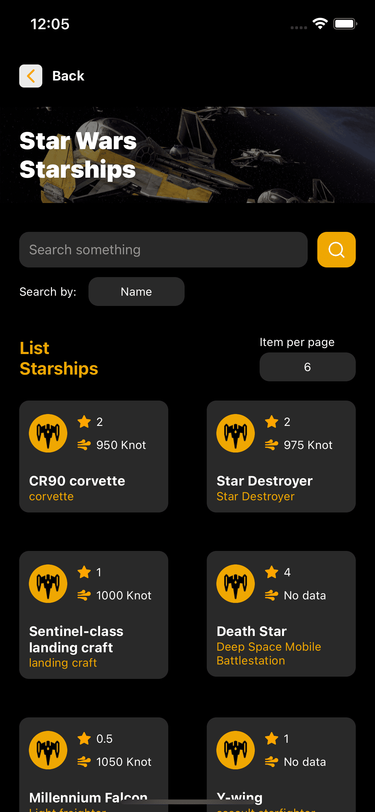
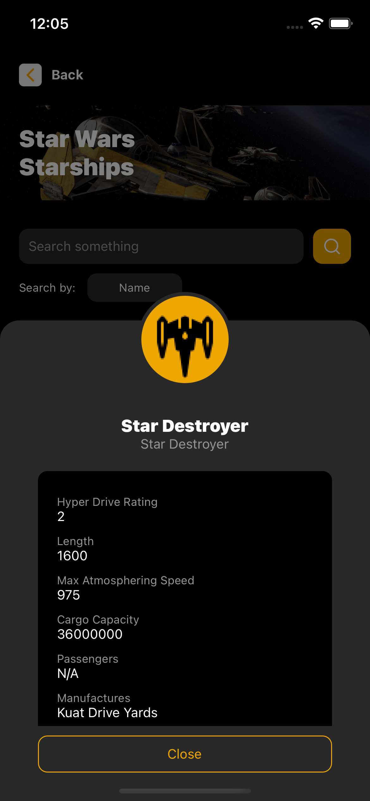

# Starwars Sayurbox Test

## Web Screenshoot

 
 

## iOS Screenshoot

 
 
 
 
 

# Demo website : https://sayurbox.akhmadkha.id/

### Tech Stack :
 - React Native
 - Typescript
 - GraphQL

### Start on Web :
- yarn install
- yarn run web 

### Start on iOS :
 - See documentation: https://reactnative.dev/docs/running-on-device

### Start on Android :
 - See documentation: https://reactnative.dev/docs/running-on-device

